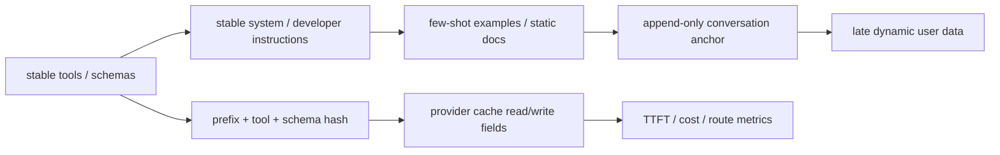

# LLM Cache Audit Skill

[](https://github.com/sernote/audit-prompt-caching/actions/workflows/ci.yml)
[](LICENSE)


`audit-prompt-caching` is a portable Codex/agent skill for finding why LLM cache reuse fails across the request path: prompt/prefix caches, provider cache telemetry, cache-aware routing, agent tool stability, Bedrock checkpoints, OpenRouter routing drift, provider migration risk, and vLLM/SGLang KV reuse.

## Why This Exists

LLM cache reuse usually fails silently. A timestamp in the system prompt, shuffled tool schemas, a changed first user message, an OpenRouter fallback, or a new vLLM replica can turn repeated 20k-token requests into cold prefill again.

That failure is expensive because it often looks like a generic "LLM cost went up" or "agents got slower" incident. This skill gives agents a cache-specific audit path: inspect prefix stability, provider semantics, cache telemetry, routing locality, KV pressure, and whether caching is even the right lever.

## Quick Start

Install the skill:

```bash
npx skills add https://github.com/sernote/audit-prompt-caching --skill audit-prompt-caching
```

Then start a new Codex session and ask:

```text
Use $audit-prompt-caching to audit this repo for prompt-cache misses, unstable prompt prefixes, dynamic tools/schemas, routing issues, and deployment cache-locality problems.
```

```text
Use $audit-prompt-caching to audit this OpenAI app. cached_tokens stays at 0 even though the system prompt is 8k tokens.
```

## Local Demo

Run the fixture audit locally:

```bash
git clone --depth 1 https://github.com/sernote/audit-prompt-caching.git
cd audit-prompt-caching
python3 audit-prompt-caching/scripts/analyze_usage_logs.py \
  fixtures/openai/repeated_prefix_usage.jsonl
```

Render a report from the same fixture:

```bash
python3 audit-prompt-caching/scripts/render_audit_report.py \
  --usage-log fixtures/openai/repeated_prefix_usage.jsonl \
  --provider openai \
  --engine "Responses API" \
  --finding "fixtures/openai/repeated_prefix_usage.jsonl:1 | low | openai | cold request has zero cached tokens | first request pays full prefill | warm repeated prefix before measuring steady state | confirm warm cached_tokens increase"
```

Lint known-good rendered request fixtures:

```bash
python3 audit-prompt-caching/scripts/layout_linter.py \
  fixtures/layout/good_openai_request.json
python3 audit-prompt-caching/scripts/layout_linter.py \
  fixtures/layout/good_openai_responses_request.json
```

`layout_linter.py` accepts Chat-style `messages` payloads and Responses-style
`input` payloads when checking for volatile early content, unstable tool order,
and dynamic schema fields.

## Audit Hero Shot

```text
+------------------------------------------------------------+
| LLM CACHE AUDIT                                            |
+------------------------------------------------------------+
| Provider/API: openai / Responses API                       |
| Cache hit ratio: 59.62%                                    |
| Output share: 7.17%                                        |
| Main blocker: cold request has zero cached tokens           |
| Cache impact: first request pays full prefill               |
| Fix: warm repeated prefix before measuring steady state     |
| Validate: confirm cached-token fields and TTFT improve      |
+------------------------------------------------------------+
```

## Fixture Signal

The bundled OpenAI fixture is synthetic and safe to share, but it is still executable evidence:

| Signal | Value |
|---|---:|
| Records reviewed | 3 |
| Input tokens | 15,600 |
| Cached tokens | 9,300 |
| Cache hit ratio | 59.62% |
| Output share | 7.17% |

Example ROI model for 1,000 requests with 9k static input tokens, 300 dynamic input tokens, 2k output tokens, 71% cache hit rate, and explicit sample prices:

```text
Total cost: $34.60 -> $23.10
Total savings: 33.24%
Input savings: 61.84%
```

These are fixture numbers, not a production guarantee. Always validate with your provider usage fields and billing export.

## Cache Flow



## Positioning

This project is a static audit skill plus dependency-free local scripts. It complements runtime observability and gateway tools rather than replacing them.

| Project | Primary job | Static cache-path audit | Portable agent skill | Stdlib-only local scripts |
|---|---|---:|---:|---:|
| `audit-prompt-caching` | Cross-provider prompt/prefix/KV cache audit | yes | yes | yes |
| [ussumant/cache-audit](https://github.com/ussumant/cache-audit) | Claude Code cache-rules skill | Claude-focused | Claude Code-focused | single skill |
| [Helicone](https://github.com/Helicone/helicone) | LLM observability and gateway | runtime-oriented | no | no |
| [Langfuse](https://github.com/langfuse/langfuse) | LLM observability, evals, prompt management | runtime-oriented | no | no |
| [LiteLLM](https://github.com/BerriAI/litellm) | LLM gateway/proxy | runtime/gateway-oriented | no | no |

## Who It Is For

- AI engineers debugging prompt-cache misses or long TTFT.
- Backend engineers building LLM request paths.
- Agent developers working with tools, MCP, compaction, or coding assistants.
- Platform/SRE engineers running vLLM, SGLang, or multi-replica inference.
- Teams comparing providers or estimating effective LLM cost.

## What It Audits

- Prompt-cache applicability before recommending changes.
- Stable prompt prefix layout.
- Volatile data in system prompts and early messages.
- Non-deterministic tool/schema serialization.
- Dynamic tool sets inside agent loops.
- History truncation, compaction, and summarization.
- Cache-aware routing for managed and self-hosted inference.
- OpenRouter sticky routing, provider fallback, and cache read/write fields.
- Amazon Bedrock cache checkpoints and read/write fields.
- Prefill vs decode latency and output-token cost share.
- KV-cache budget, eviction, and deployment config.
- Provider-specific usage fields and docs freshness.
- ROI assumptions across static, dynamic, and output tokens.
- CI/smoke-test readiness for stable prefix drift.

## Primary Workflow: Audit A Project

The main use case is an agent working inside a project repository. The skill should first inspect source code and configuration, then use logs or rendered payloads as evidence when they are available.

The agent should start with project artifacts such as:

- prompt builders, prompt templates, and request renderers
- provider SDK calls and cache-control parameters
- tool registries, JSON schemas, structured-output definitions, and serialization code
- conversation history, compaction, truncation, and agent-loop logic
- environment config, feature flags, router/gateway config, and provider selection
- Docker Compose, Kubernetes, Helm, vLLM, SGLang, or other inference deployment files

Usage logs, billing exports, rendered JSON request payloads, prefix hashes, traces, and latency data are supporting evidence. They help confirm symptoms, compare before/after prefixes, calculate cache read/write ratios, and estimate ROI, but they are not the primary entry point for the skill.

## Bundled Scripts

The skill includes small dependency-free helpers for repeatable audits:

```bash
python3 audit-prompt-caching/scripts/extract_llm_calls.py .
python3 audit-prompt-caching/scripts/layout_linter.py path/to/rendered_request.json
python3 audit-prompt-caching/scripts/prefix_stability_check.py before.json after.json
python3 audit-prompt-caching/scripts/analyze_usage_logs.py usage.jsonl
python3 audit-prompt-caching/scripts/analyze_usage_logs.py --jsonl-normalized usage.jsonl
python3 audit-prompt-caching/scripts/estimate_cache_roi.py \
  --static-tokens 9000 \
  --dynamic-tokens 300 \
  --output-tokens 2000 \
  --requests 100 \
  --hit-rate 0.8 \
  --input-price-per-mtok 2.0 \
  --cached-input-price-per-mtok 0.2 \
  --output-price-per-mtok 8.0
python3 audit-prompt-caching/scripts/render_audit_report.py \
  --usage-log path/to/usage.jsonl \
  --provider openai \
  --engine "Responses API" \
  --finding "src/llm/request.py:42 | high | openai | dynamic timestamp in system prompt | timestamp changes the cacheable prefix on every call | move volatile metadata after the stable prefix | compare rendered request bytes across repeated calls"
python3 audit-prompt-caching/scripts/validate_skill_package.py audit-prompt-caching
python3 audit-prompt-caching/scripts/run_trigger_eval.py audit-prompt-caching
```

`layout_linter.py` accepts rendered Chat-style `messages` payloads and
Responses-style `input` payloads.

`prefix_stability_check.py` compares raw bytes by default so JSON key-order drift is visible. Use `--canonical-json` only when sorted-key normalization is intentional.

Provider usage metadata and billing exports remain authoritative; these scripts are audit aids.

## Evidence Artifacts

Fixtures are not required for a real audit. They are bundled demo and regression-test data that show expected file shapes without needing a production project or production logs.

When evidence is needed, point the scripts at exported artifacts from the user's system:

```bash
python3 audit-prompt-caching/scripts/analyze_usage_logs.py path/to/real_usage.jsonl
python3 audit-prompt-caching/scripts/layout_linter.py path/to/rendered_request.json
python3 audit-prompt-caching/scripts/prefix_stability_check.py request_a.json request_b.json
```

Good real inputs are:

- provider usage logs or billing exports with cache read/write fields
- one or more rendered JSON request payloads from the hot path, such as Chat-style `messages` or Responses-style `input`
- normalized per-step agent logs with model, route, prefix hash, tools hash, token usage, and latency
- deployment or router config when cache locality or self-hosted KV reuse is part of the issue

The skill does not capture live traffic by itself. Export or redact representative records first when telemetry evidence is needed. Keep bundled fixtures for demos, tests, and examples of the expected schema.

## Example Prompts

Use these as pressure scenarios, not generic smoke tests.

OpenAI-compatible wrapper ambiguity:

```text
Use $audit-prompt-caching to review this app. It imports the OpenAI SDK, but base_url points to https://openrouter.ai/api/v1. We added prompt_cache_key, provider.order, and openrouter/auto; cache_write_tokens appears, but cached_tokens stays zero. Decide whether this is an OpenAI issue or a router/cache-locality issue.
```

Claude automatic caching writes every request:

```text
Use $audit-prompt-caching to audit our Claude layout. We added top-level cache_control to an 18k-token policy prompt, then append timestamp and user question as the final content block. usage.cache_creation_input_tokens increments every request, but cache_read_input_tokens stays zero.
```

Bedrock Converse cross-region cachePoint:

```text
Use $audit-prompt-caching to review this Bedrock Converse request. cachePoint is placed after a user-specific intro, tools differ by route, CacheWriteInputTokens is high, CacheReadInputTokens is near zero, and some traffic uses cross-region inference.
```

MCP tool registry drift:

```text
Use $audit-prompt-caching to audit our coding agent. The MCP tool registry is queried every step, tool order changes with plugin load timing, read-only mode removes write tools, and compaction rewrites the first user turn. Costs rose even though each step sends fewer tools.
```

vLLM/SGLang multi-replica KV:

```text
Use $audit-prompt-caching to inspect this self-hosted deployment. vLLM/SGLang replicas sit behind a generic gateway, p99 prompt length is 12k, max_model_len is 128k, prefix hashes look stable, but TTFT spikes after scaling and prefix-cache metrics vary by replica.
```

High cached tokens, low savings:

```text
Use $audit-prompt-caching to explain why this workload still costs too much. cached_tokens is high and TTFT improved, but responses average 4k output tokens, tool calls add seconds, TPM errors did not improve, and finance wants to know whether prompt caching is the wrong lever.
```

## Structure

```text
audit-prompt-caching/
  SKILL.md
  agents/openai.yaml
  references/
    openai.md
    openrouter.md
    azure-openai.md
    anthropic.md
    bedrock.md
    agent-tools.md
    sglang.md
    vllm.md
    deepseek.md
    economics.md
    gemini.md
    mechanics.md
    predeploy-checklist.md
    report-template.md
    qwen.md
    yandexgpt.md
    zai.md
    use-cases.md
  scripts/
    analyze_usage_logs.py
    estimate_cache_roi.py
    extract_llm_calls.py
    layout_linter.py
    prefix_stability_check.py
    render_audit_report.py
    validate_skill_package.py
    run_trigger_eval.py
  evals/
    evals.json
    trigger_eval.json
fixtures/
  layout/
  openai/
  anthropic/
  bedrock/
  openrouter/
  vllm/
  expected/
```

## Validation

Validate the skill package with the bundled validator:

```bash
python3 audit-prompt-caching/scripts/validate_skill_package.py audit-prompt-caching
python3 audit-prompt-caching/scripts/run_trigger_eval.py audit-prompt-caching
```

The repository also includes JSON eval prompts:

- `audit-prompt-caching/evals/evals.json`: behavioral audit scenarios.
- `audit-prompt-caching/evals/trigger_eval.json`: should-trigger and should-not-trigger queries.

Run the local script/package tests:

```bash
python3 -m unittest tests/test_prompt_cache_scripts.py
```

These evals are a starting point. A full proof cycle should still compare baseline agent behavior against behavior with the skill enabled.

## Project Quality Gates

CI runs the unittest suite, package validator, trigger eval, Python syntax compile, whitespace check, and generated-bytecode guard. Keep new scripts stdlib-only and add fixture-backed tests for behavior changes.

## Freshness Policy

Provider cache behavior changes. The skill treats bundled provider references as heuristics and instructs the agent to verify official docs before exact claims about pricing, TTL, model support, field names, cache-control semantics, or routing hints.

## License

MIT. See `LICENSE`.
